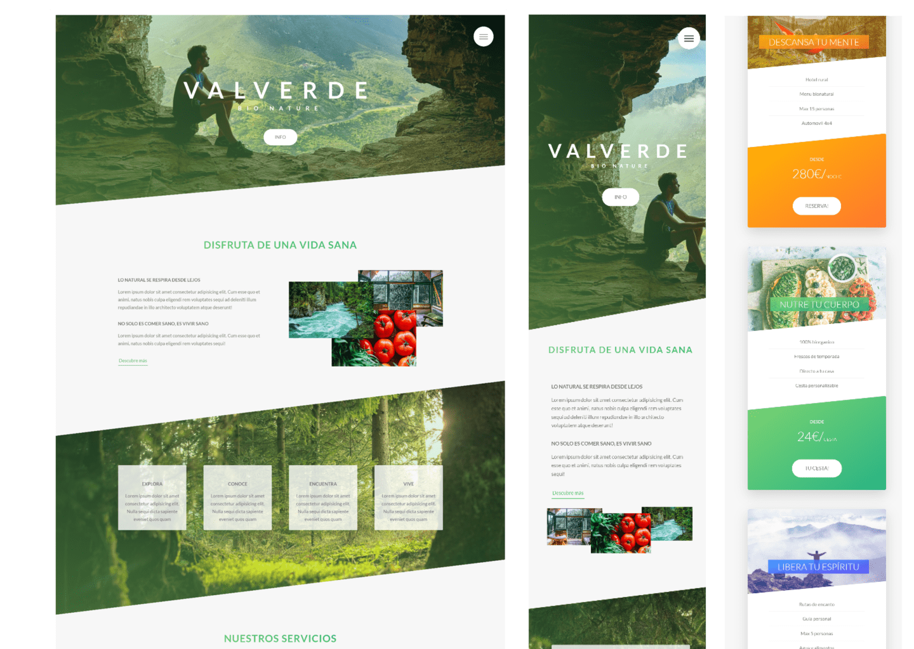

# 🌿 Valverde BioNature

## Overview

Valverde BIOnature is a static web page dedicated to promoting a natural
lifestyle and organic eating. This single-page website showcases the beauty of
nature and the benefits of organic living through engaging content and smooth
animations. It is built using HTML, SASS, and JavaScript, featuring card
rotations, button effects, and transitions for images and navigation.

## Features

- **Nature & Organic Focus**: Promotes a natural lifestyle and organic eating.
- **Engaging Animations**: Smooth card rotations, button effects, and image
  transitions.
- **Responsive Design**: Ensures a seamless experience on various devices.

## Technologies Used

- :
  HTML for structuring the web page.
- :
  SASS for styling the web page with clean and maintainable CSS.
- :
  JavaScript for adding interactivity and animations.

## Installation

To view the website locally:

1. Clone the repository to your local machine.
2. Navigate to the project directory.
3. Open the `index.html` file in your web browser.

## Screenshots

## Live Demo

Check out the live version of the website
[here](https://valverde-bionature.netlify.app/).
